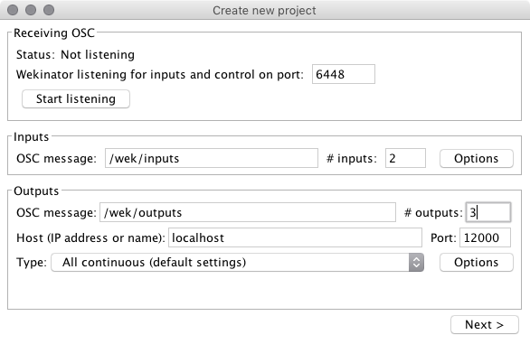

# Einführung in ML 5: Wekinator Web

Diese Experiment basiert auf dem Code von [Derick Ostrenko](https://github.com/fredeerock/wekp5).
Wir verwenden einen Webserver auf Basis von [Node.js](http://nodejs.org) um zwischen dem Webbrowser und Wekinator zu kommunizieren.

* Hierfür wird zwischen Webbrowser und Webserver eine [Websocket-Verbindung](https://developer.mozilla.org/en-US/docs/Web/API/WebSockets_API) mit [Socket.io](http://socket.io) hergestellt.
* Einkommende Signale vom Browser werden dann über über [OSC-Nachrichten](https://developer.mozilla.org/en-US/docs/Web/API/WebSockets_API) an [Wekinator](http://www.wekinator.org) geschickt.
* Kommt eine Antwort von Wekinator als OSC-Nachricht, so wird diese über den Websocket-Kanal an den Webbrowser weitergegeben.

## Installation

### Node.js

Dieses Experiment startet einen Node.js Server und stellt die Webinhalte statisch zur Verfügung.
Hierfür müssen einige Module installiert werden.

```bash
npm install
```

### Wekinator

Starte ein neues Wekinator-Projekt mit den folgenden Einstellungen:

| Einstellung | Wert |
|--|--|
| Input Port | 6448 |
| Input path | /wek/inputs |
| **# inputs** | **2** |
| Outputs path | /wek/outputs |
| **# outputs** | **3** |
| Host | localhost |
| Output port | 12000 |
| Type | All continuous (default settings) |

Screenshot:



## Das Experiment starten

Das Experiment starten wir nun wie gewohnt über npm:

```bash
cd C:\Projekt\Ordner
npm start
```

Danach ist die Übung über einen Webbrowser der Wahl unter folgender Addresse erreichbar:
[http://localhost:1234](http://localhost:1234)
