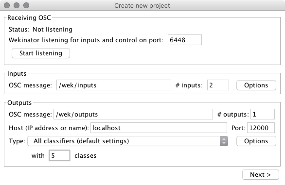
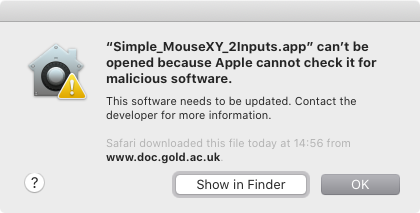
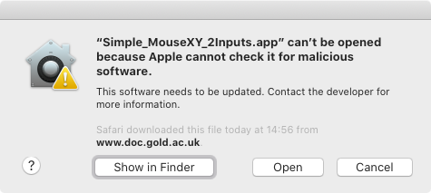
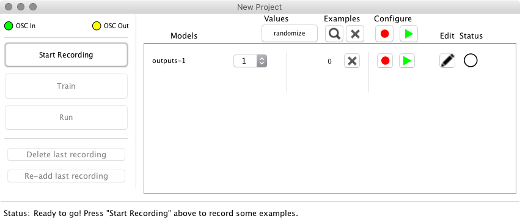
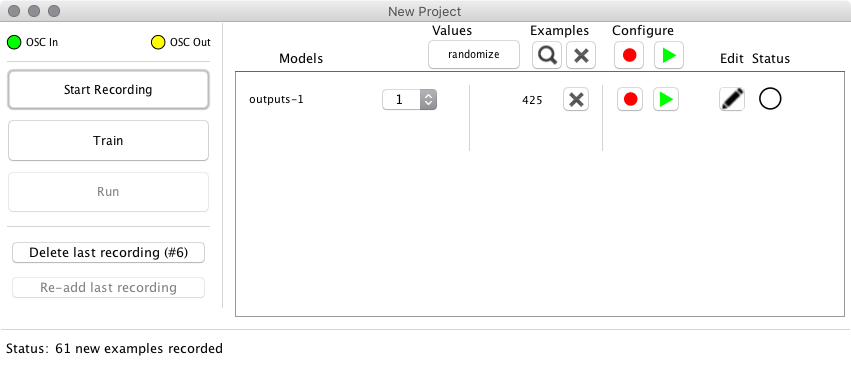
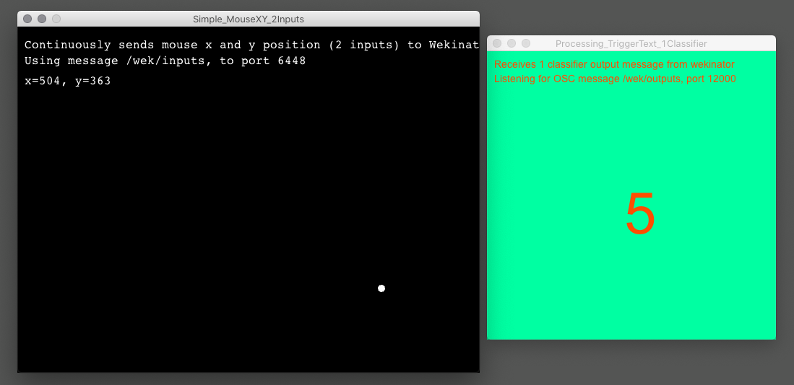

# Einführung in ML 1: Wekinator Start (Classification)

Dieses Experiment dient zur Einführung in [Wekinator](http://www.wekinator.org).
Wir nutzen *klassifizieren* eine simple Eingabe.

## Installation

### Wekinator

1. Installiere Wekinator der [Version 2.1.0.4](https://github.com/fiebrink1/wekinator/releases/tag/v2.1.0.4).
2. Lade den [Wekinator Quick Start Pack](http://www.wekinator.org/examples/#Quick_Start_Pack) runter und entpacke ihn.

## Experiment starten

### Wekinator Projekt anlegen

Starte ein neues Wekinator-Projekt mit den folgenden Einstellungen:

| Einstellung | Wert |
|--|--|
| Input Port | 6448 |
| Input path | /wek/inputs |
| **# inputs** | **2** |
| Outputs path | /wek/outputs |
| **# outputs** | **1** |
| Host | localhost |
| Output port | 12000 |
| **Type** | **All classifiers (default settings)** |
| **with** | **5 classes** |

Screenshot:

Drücke zum starten des Probjekt auf `Next`.

Die Einstellungen des Projekt hängen von den Parametern der Eingabe- und Ausgabeanwendungen ab. In diesem Projekt möchten wir die `X` und `Y`-Position des Mauszeigers (2 Input-Kanäle) auf einer von fünf Klassen (1 Output-Kanal) abbilden.

### Eingabe-Anwendung starten

Starte die Anwendung `Simple_MouseXY_2Inputs` des [Wekinator Quick Start Pack](http://www.wekinator.org/examples/#Quick_Start_Pack) im Ordner `Inputs/Simple_MouseXY_2Inputs`.
Diese Anwendung empfängt die `X` und `Y` Position des Mauszeigers innerhalb des Fensters. Diese Werte werden an Wekinator als "Eingabewerte" geschickt.

#### MacOS Probleme beim Start der Anwendungen

MacOS hat mit einem der letzten Systemupdates eingeführt, dass nur von Apple zertifizierte Programme gestartet werden können (Gatekeeper). Die Beispiele von Wekinator sind dies nicht. Um diese Programme zu starten, müssen wir diese einmalig manuell erlauben.

1. Startet ein Programm über Doppelklick auf das Anwendungssymbol. Ihr bekommt folgenden Fehler:

2. Wähle im Popup `OK`.
3. Klicke nun mit der rechten Maustaste erneut auf das Anwendungssymbol (alternativ: STRG+Klick) und wähle `Öffnen`. Es erscheint ein weitereres Fenster:

4. Wähle nun die Option `Öffnen`. Das Programm startet und kann ab sofort normal über einen Doppelklick gestartet werden.

### Ausgabe-Anwendung starten

Starte die Anwendung `Processing_TriggerText_1Classifier` im Ordner `Outputs`.

### Trainieren

Bevor Wekinator klassifizieren kann, müssen wir ihm beibringen, welche Mausposition für welche Klasse steht. Im Wekinator-Fenster findet ihr den vorher definierten Ausgabekanal `outputs-1`. Daneben ist ein Dropdown-Fenster, in welchem die unterschiedlichen Klassen gewählt werden können.

Nun erzeugen wir für jede Klasse Trainingsdaten:

1. Hierfür wählen wir eine Outputklasse aus (zum Beispiel `1`)
2. Anschließen starten wir das Training über `Start Recording`
3. Jetzt erzeugen wir Trainingsdaten, indem wir im Fenster der Anwendung `Simple_MouseXY_2Inputs` in einer Ecke mit dem Mauszeigen umherfahren. Im Wekinator-Fenster könnt ihr sehen, wie die Anzahl der `Examples` ansteigt.

4. Um eine weitere Klasse zu trainieren, wähle einfache `Stop Recording`, wähle eine weitere Klasse vom Dropdown-Menü und starte die Aufzeichnung über `Start Recording`. Mache dies, bis für alle Klassen Trainingsdaten vorliegen.

5. Wenn für alle Klassen Trainingsdaten vorliegen, dann trainiere das Model über `Train`. Dies dauert nur wenige Sekunden.

### Trainiertes Model benutzen

Sobald das Model trainiert ist, können wir die Anwendung über `Run` starten. Wenn ihr nun im Fenster der Input-Anwendung `Simple_MouseXY_2Inputs` den Mauszeigen bewegt, sollte im Fenster der Ouput-Anwendung `Processing_TriggerText_1Classifier` eine Farbe und die Zahl der Klasse sehen.

## Aufgaben

1. Trainiere das Modell auf 5 Klassen
    * Klasse 1: links oben
    * Klasse 2: rechts oben
    * Klasse 3: mittig
    * Klasse 4: links unten
    * Klasse 5: rechts unten

2. 

## Weitere Infos

Für mehr Infos siehe die [Wekinator Walkthrough Instructions](http://www.wekinator.org/walkthrough/) oder die [Detailed Instructions](http://www.wekinator.org/detailed-instructions/).