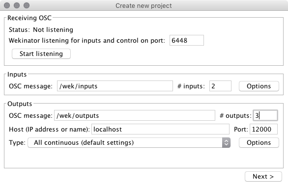
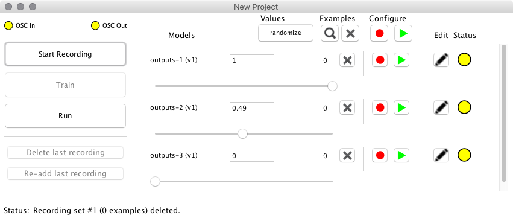

# Einführung in ML: Wekinator Web (Regression)

Diese Experiment basiert auf dem Code von [Derick Ostrenko](https://github.com/fredeerock/wekp5).
Wir verwenden einen Webserver auf Basis von [Node.js](http://nodejs.org) um zwischen dem Webbrowser und Wekinator zu kommunizieren.

* Hierfür wird zwischen Webbrowser und Webserver eine [Websocket-Verbindung](https://developer.mozilla.org/en-US/docs/Web/API/WebSockets_API) mit [Socket.io](http://socket.io) hergestellt.
* Einkommende Signale vom Browser werden dann über über [OSC-Nachrichten](https://developer.mozilla.org/en-US/docs/Web/API/WebSockets_API) an [Wekinator](http://www.wekinator.org) geschickt.
* Kommt eine Antwort von Wekinator als OSC-Nachricht, so wird diese über den Websocket-Kanal an den Webbrowser weitergegeben.

Im Experiment trainieren wir ein Model darauf die `X` und `Y` Position des Mauszeigers in einen `RGB`-Wert zu übersetzen.

## Aufbau

* `app.js`: Beinhaltet den Nodejs-Webserver inklusive OSC Verbindung zu Wekinator und Websocket-Verbindung zum Browser
* `public/`: Dieser Ordner enthält alle Dateien, die als Webseite ausgegeben werden
  * `public/sketch.js`: Beinhaltet die Webserver-Verbindung

## Installation

### Node.js

Dieses Experiment startet einen Node.js Server und stellt die Webinhalte statisch zur Verfügung.
Hierfür müssen einige Module installiert werden.

```bash
npm install
```

### Wekinator

Starte ein neues Wekinator-Projekt mit den folgenden Einstellungen:

| Einstellung | Wert |
|--|--|
| Input Port | 6448 |
| Input path | /wek/inputs |
| **# inputs** | **2** |
| Outputs path | /wek/outputs |
| **# outputs** | **3** |
| Host | localhost |
| Output port | 12000 |
| Type | All continuous (default settings) |

Screenshot:



## Das Experiment starten

Das Experiment starten wir nun wie gewohnt über npm:

```bash
cd C:\Projekt\Ordner
npm start
```

Danach ist die Übung über einen Webbrowser der Wahl unter folgender Addresse erreichbar:
[http://localhost:1234](http://localhost:1234)

### Training

Zum Training stellst du in Wekinator den gewünschten Regressions-Wert ein und erzeugst Trainingsdaten:

1. Definiere einen Ausgabewert über die Slider. Der erste steht für den *Rot*-Wert, der zweite für *Grün* und der dritte für *Blau*. Das `Canvas` auf der Website sollte die gewählt Farbe widerspiegeln.

2. Starte die Aufzeichnung mit `Start Recording``
3. Bewege die Maus in der Website um Trainingsdaten zu erzeugen
4. Stoppe die Aufzeichnung mit `Stop Recording`
5. Verändere die Slider um eine neue Farbe zu erhalten und erzeuge hierfür neue Trainingsdaten.
6. Sobald du genug Trainingsdaten erzeugt hast, drücke in Wekinator auf `Train`

### Model benutzen

Das Model hat nun gelernt, wie `X` und `Y` Position der Maus in `R,G,B` Werte zu übersetzen sind.

1. Starte das Model in Wekinator über `Run`
2. Bewege die Maus über das `Canvas` in der Website
3. Der Hintergrund des `Canvas` wird sich nun dynamisch der gelernten Farbe anpassen.

## Aufgaben

1. Bringe die Übung zum Laufen und trainiere das Model folgendermaßen:
    * Wenn die Maus oben links ist: *Rot*
    * Wenn die Maus mittig ist: *Grün*
    * Wenn die Maus unten rechts ist: *Blau*

2. Schreibe den RGB-Wert als Text
    * Erweitere die `sketch.js` Datei
    * Nutze P5js `text()` (https://p5js.org/reference/#/p5/text)
    * Aktualisiere den Text innerhalb der `draw()`-Methode

3. Verwende die Anwendung `Simple_MouseXY_2Inputs` als Eingabe
    * Jede Anwendung die per OSC Nachrichten an Wekinator senden kann, kann verwendet werden, solange die Inputs stimmen.
