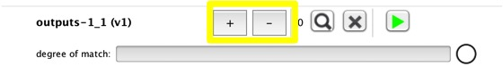

# Einführung in ML: Wekinator Web mit DWT

Diese Experiment basiert auf Wekinator-Web.

Anstatt die Eingabe per Maus-Position direkt zu Klassifizieren, trainieren wir das Model auf Veränderung der Mausposition über die Zeit.

Wekinator bietet hierfür die Möglichkeit des [Dynamic Time Warping](http://www.wekinator.org/detailed-instructions/#Dynamic_time_warping_in_Wekinator). DWT beschreibt einen [Algorithmus](https://de.wikipedia.org/wiki/Dynamic-Time-Warping), mit welchem mehrere Wertreihenfolgen aufeinander abgebildet werden können, auch wenn deren Länge unterschiedlich ist. Zum Beispiel ist es so möglich eine Geste wiederzuerkennen, auch wenn sie nicht identisch ausgeführt wird.

## Installation

### Node.js

Dieses Experiment startet einen Node.js Server und stellt die Webinhalte statisch zur Verfügung.
Hierfür müssen einige Module installiert werden.

```bash
npm install
```

### Wekinator

Starte ein neues Wekinator-Projekt mit den folgenden Einstellungen:

| Einstellung | Wert |
|--|--|
| Input Port | 6448 |
| Input path | /wek/inputs |
| **# inputs** | **2** |
| Outputs path | /wek/outputs |
| **# outputs** | **1** |
| Host | localhost |
| Output port | 12000 |
| **Type** | **All dynamic time warping (default settings)** |
| **with** | **2 gesture types** |

## Das Experiment starten

Das Experiment starten wir nun wie gewohnt über npm:

```bash
cd C:\Projekt\Ordner
npm start
```

Danach ist die Übung über einen Webbrowser der Wahl unter folgender Addresse erreichbar:
[http://localhost:1234](http://localhost:1234)

### Gesten Hinzufügen

DTW Modelle werden nicht im klassischen Sinne trainiert. Man gibt stattdessen direkt Beispiele für eine Geste an. Im Beispiel sind bereits zwei Gesten vorgesehen.

1. Wähle auf der Website die Geste, die aufgezeichnet werden soll
2. Starte die Aufzeichnung mit `Recording``
3. Klicke und ziehe die Maus in der Website um Trainingsdaten zu erzeugen
4. Speichere die Aufzeichnung indem du in Wekinator auf das "+" neben der Geste klickst.

5. Wenn du genug Aufnahmen für eine Geste gemacht hast, wechsle die Geste einfach über die Auswahl in der Website (es empfehlen sich etwa 5 Aufnahme pro Geste)

### Model benutzen

Das Model hat nun gelernt, wie die Gesten aussehen.

1. Starte das Model indem du in der Website auf `Prediction` klickst
2. Klicke und ziehe die Maus über das `Canvas` in der Website
3. Neben dem Zeiger wird je nach Geste eine anderer Text erscheinen

## Aufgaben

1. Bringe die Übung zum Laufen und trainiere das Model auf die beiden Gesten

2. Bringe dem Model eine dritte Geste bei
    * Hierzu musst du im Wekinator Projekt eine dritte Geste konfigurieren
    * Füge in der `index.html` eine weitere Auswahlmöglichkeit hinzu
    * Füge in der `public/sketch.js` Datei eine dritte Geste hinzu
    * Vergiss nicht, die Geste auch zu trainieren!

3. Steuere mithilfe der Gesten eine kleine Kugel über das Feld
    * Siehe folgendes Beispiel als Hilfe: [Move Ball with Keyboard](https://editor.p5js.org/2sman/sketches/rkGp1alib)
    * Verschiebe die Inhalte der `keyPressed`-Methode aus dem Beispiel in die `gestureRecognized`-Methode des Experiments
